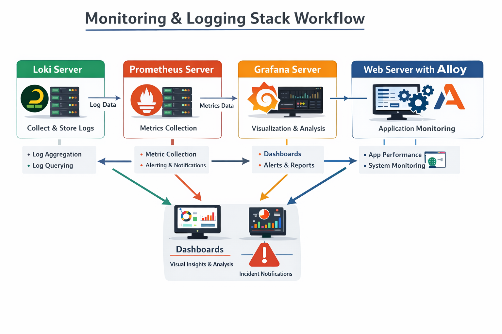

# Monitoring & Logging Stack 

This project demonstrates a complete **Monitoring & Observability Stack** deployed on AWS EC2 instances using:

* Prometheus for metrics collection
* Grafana for visualization & alerting
* Loki for log aggregation
* Alloy Agent for metrics & log forwarding
* Node Exporter for system metrics
* Python Flask application for app metrics & logs




---

## 📌 Architecture Overview

This project is based on a **4-server architecture**:

1. **Web Server**

   * Runs Flask application
   * Exposes application metrics (`/metrics`)
   * Runs Node Exporter (system metrics)
   * Runs Alloy (push logs → Loki, metrics → Prometheus)

2. **Prometheus Server**

   * Scrapes metrics from:

     * Web Server (9100 → system metrics)
     * Web Server (5000 → app metrics)
   * Stores time-series data
   * Supports PromQL queries

3. **Loki Server**

   * Receives logs from Alloy
   * Stores and indexes logs
   * Used for log analysis in Grafana

4. **Grafana Server**

   * Connects to Prometheus & Loki
   * Creates dashboards & panels
   * Defines alert rules
   * Sends alerts to Slack

---

## 🔄 Data Flow

```text
Web Server (Flask + Node Exporter + Alloy)
        ↓
   Metrics → Prometheus
        ↓
   Logs → Loki
        ↓
   Grafana (Dashboards + Alerts)
        ↓
   Slack Notifications 🚨
```

---

## ⚙️ Features

### 📊 Monitoring

* CPU utilization
* Memory usage
* Disk usage (Root FS)
* HTTP request rate
* Application metrics

### 📈 Visualization

* Custom Grafana dashboards
* Time-series graphs
* Gauge panels (threshold-based)
* Dynamic variables (endpoint filtering)

### 🚨 Alerting

* Threshold-based alerts (e.g., Disk > 65%)
* Alert rules with evaluation intervals
* Slack integration via webhook
* Alert states:

  * Pending
  * Firing
  * Resolved

### 📜 Logging

* Centralized logs using Loki
* Logs collected from `/var/log/titan`
* Query logs directly in Grafana

---

## 🛠️ Setup

### 1. Clone Repository

```bash
git clone https://github.com/AhmadAlabrash/monitoring-prometheus-grafana.git
cd monitoring-prometheus-grafana
```

---

### 2. Setup Servers (EC2)

Create 4 instances:

* Grafana Server
* Prometheus Server
* Loki Server
* Web Server

---

### 3. Run Setup Scripts

Each server has its own setup script:

```bash
# Grafana
./grafana-setup.sh

# Prometheus
./prometheus-setup.sh

# Loki
./loki-setup.sh

# Web Server (App + Node Exporter + Alloy)
./web-node-setup.sh
```

---

### 4. Configure Prometheus Targets

Edit:

```bash
/etc/prometheus/prometheus.yml
```

Add:

```yaml
- job_name: "web-server-system"
  static_configs:
    - targets: ["WEB_PRIVATE_IP:9100"]

- job_name: "web-server-app"
  static_configs:
    - targets: ["WEB_PRIVATE_IP:5000"]
```

---

### 5. Restart Prometheus

```bash
systemctl restart prometheus
```

---

### 6. Access Services

| Service       | URL                       |
| ------------- | ------------------------- |
| Grafana       | http://GRAFANA_IP:3000    |
| Prometheus    | http://PROMETHEUS_IP:9090 |
| App           | http://WEB_IP:5000        |
| Node Exporter | http://WEB_IP:9100        |

---

## 📊 Example PromQL Queries

### CPU Usage

```promql
100 - (avg by(instance) (irate(node_cpu_seconds_total{mode="idle"}[5m])) * 100)
```

### Memory Available

```promql
node_memory_MemAvailable_bytes / 1024^2
```

### Disk Usage %

```promql
(1 - (node_filesystem_avail_bytes{mountpoint="/"} / node_filesystem_size_bytes{mountpoint="/"})) * 100
```

### HTTP Request Rate

```promql
rate(http_requests_total[5m])
```

---

## 🔔 Alert Example

* Metric: Root Disk Usage
* Threshold: `> 65%`
* Evaluation: Every 1 minute
* Notification: Slack


## 🧠 Key Concepts

* **Scraping** → Prometheus pulls metrics
* **Push Model** → Alloy pushes logs to Loki
* **Time-Series Data** → Metrics stored over time
* **PromQL** → Query language for metrics
* **Dashboards** → Visual monitoring
* **Alerting** → Automated incident detection

---

## ⚠️ Notes

* Use **Private IPs** between servers

* Open required ports:

  * 3000 (Grafana)
  * 9090 (Prometheus)
  * 3100 (Loki)
  * 5000 (App)
  * 9100 (Node Exporter)

* Public IPs change after restart → update configs if needed

---

## 💡 Future Improvements

* Add Kubernetes monitoring (Prometheus Operator)
* Add Alertmanager instead of Grafana alerts
* Add tracing (Tempo / Jaeger)
* Add CI/CD pipeline
* Use Terraform for infra provisioning

---

## 👨‍💻 Author
